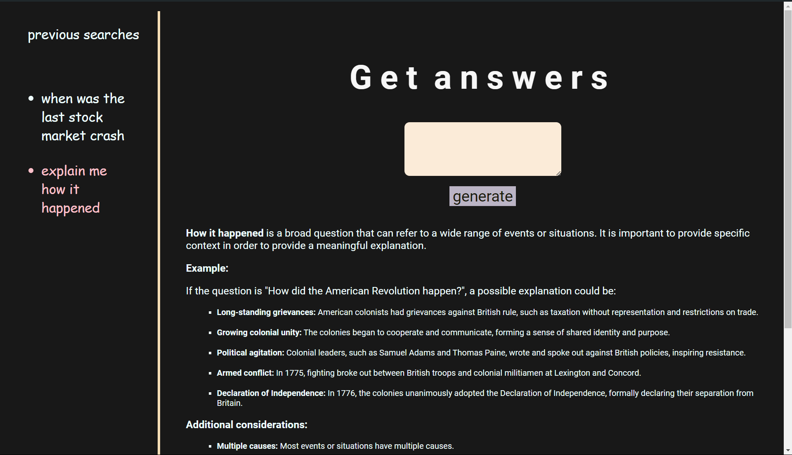

<!-- # Chat with BOT

This is a react project made using gemini api.

```
To run this code get your api key from https://generativelanguage.googleapis.com and replace it in the url section in app.jsx section and install the following dependencies
```

bash

### npm install

#### npm install axios

### npm install react-markdown

### npm run dev

and you will be all set to run this -->

# Chat with BOT

This React project allows you to have interactive conversations with a large language model powered by Google's Gemini API.

Features:

Ask questions: Get answers to your queries in a comprehensive and informative way.
Natural language interaction: Communicate with the bot using natural language, similar to how you would chat with a person.
Prerequisites:

Node.js and npm: Ensure you have Node.js and npm (Node Package Manager) installed on your system. You can download them from https://nodejs.org/en.

```
Installation:
npm install: This command will install the necessary dependencies (axios and react-markdown) required for the project to function.

This command will install the necessary dependencies (axios and react-markdown) required for the project to function.

```
### website link : https://jimmysai.netlify.app/
Usage:

Type your question:
Enter your question or prompt in the text area provided.

Generate answer:
Click the "generate" button to send your question to the Gemini API.

Receive response:
The application will display the answer generated by the Gemini API in the markdown content area. The answer will be presented in a clear and informative format.

Additional Notes:

Feel free to experiment with different questions and prompts to explore the capabilities of the Gemini API.
Remember to replace the placeholder API key in app.jsx with your valid key for the application to function correctly.
Consider adding error handling or user feedback mechanisms to enhance the user experience.

## Screenshot of the website



This project is still in completion
